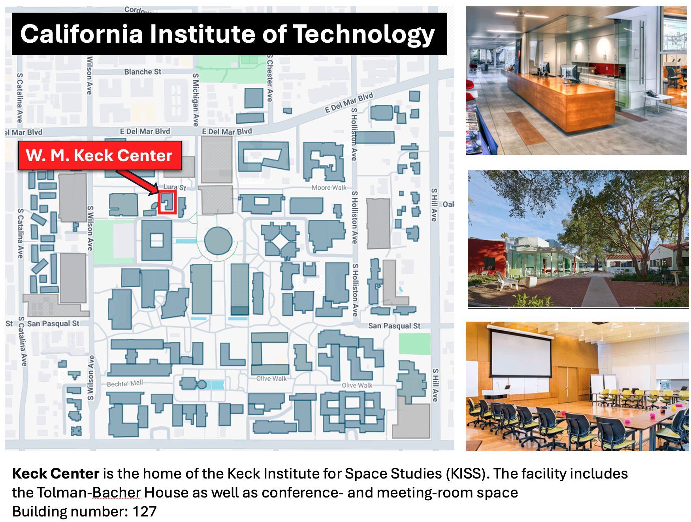

# Event Logistics

## Caltech Wireless Network

1. select 'Caltech Visitor' network
2. direct your browser to any web page
3. redirect to splash screen and enter credentials below

* WiFi: Caltech Visitor
* Username: ECCO
* Password: Hackweek2024

Notes: 
1. you may also join Caltech wifi via eduroam if provided by your institution
2. you may need to login using Google chrome to avoid "OCSP"
3. you may need to disable browser extensions that prevent the authorization screen from appearing
4. network will be active Oct 14-18

## Location

* Tutorials and courses will occur in the W. M. Keck Center on the Caltech campus 

[Detailed maps, parking instructions, and driving directions from area airports](https://www.kiss.caltech.edu/directions.html)

[Interactive Caltech campus map](https://www.caltech.edu/map/campus/w-m-keck-center)

[Google map directions to the Keck Center](https://www.google.com/maps?daddr=34.13983634392368,-118.12651734799147&saddr=34.20043487922543,-118.16947571072777)

## Program

* Doors open at 8:30 am each morning (Monday-Friday). We will start the morning
  sessions at 9:00 am sharp.
* Due to space limitations, only registered participants will be allowed
  to attend the tutorials and open working sessions.
* Participants are expected to attend all scheduled activities. Contact
  {{ contact_email }} if any circumstances prevent you from attending.

## Hotels 

(in very approximate order of likely cost)

* [Saga Motor Hotel](https://thesagamotorhotel.com/) (0.9 miles away) \
1635 E. Colorado Blvd. Pasadena, CA 91106 \

* [Howard Johnson by Wyndham Pasadena](https://www.wyndhamhotels.com/hojo/pasadena-california/howard-johnson-pasadena/overview) (0.9 miles away) \
1599 E Colorado Blvd, Pasadena, CA 91106 

* [Travelodge by Wyndham Pasadena Central](https://www.wyndhamhotels.com/travelodge/pasadena-california/travelodge-pasadena-central/overview) (1.5 miles away) \
2131 E Colorado Blvd, Pasadena, CA 91107

* [GreenTree Pasadena Inn](https://www.greentreeinn.com/hotels/ca/pasadena) (1.5 miles away) \
400 S Arroyo Pkwy, Pasadena, CA 91105

* [Pasadena Rose & Crown Hotel](https://www.pasadenaroseandcrown.com/) (0.5 miles away) \
1203 E Colorado Blvd, Pasadena, CA 91106

* [Courtyard by Marriott Pasadena](https://www.marriott.com/en-us/hotels/laxot-courtyard-los-angeles-pasadena-old-town/overview/) (2 miles away) \
180 N. Fair Oaks Ave. Pasadena, CA 91103 \
May have complimentary transportation to Caltech.

* [Westin Hotel Pasadena](https://www.marriott.com/en-us/hotels/laxpw-the-westin-pasadena/overview/) (1.5 miles away) \
191 N. Los Robles Ave. Pasadena, CA 91101 \
May have complimentary transportation to Caltech.

* [Hilton Pasadena](https://www.hilton.com/en/hotels/pasphhf-hilton-pasadena/) (0.8 miles away) \
168 S. Los Robles Ave. Pasadena, CA 91101 

* [Hotel Dena, Pasadena](https://www.marriott.com/en-us/hotels/burpt-hotel-dena-pasadena-los-angeles-a-tribute-portfolio-hotel/overview/) (1 mile away) \
303 E. Cordova St. Pasadena, CA 91101 \
May have complimentary transportation to Caltech.

* [Hyatt Place Pasadena](https://www.hyatt.com/hyatt-place/en-US/laczp-hyatt-place-pasadena) (1.2 miles away) \
399 E Green St, Pasadena, CA 91101

* [Pasadena Hotel & Pool](https://www.pasadenahotel.com/) (0.6 miles away) \
928 E Colorado Blvd, Pasadena, CA 91106

## Meals

* Caltech Campus and the surrounding Pasadena neighborhood has several cafeterias, restaurants and cafes.
* Light refreshments will be served in the morning and afternoon sessions

